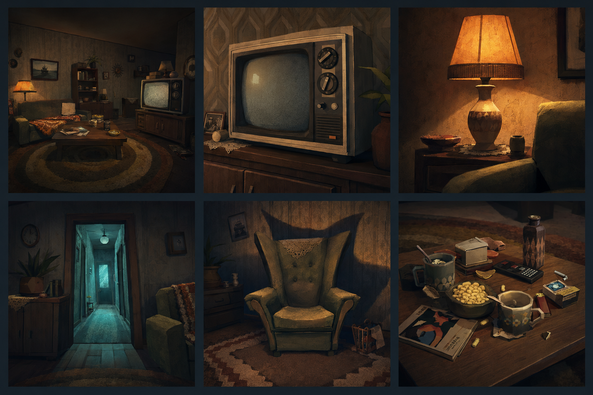
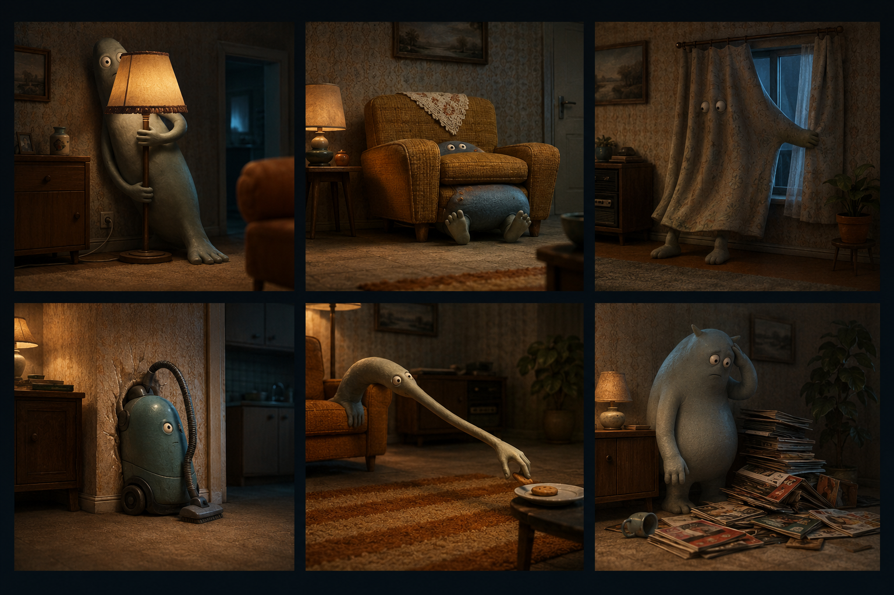
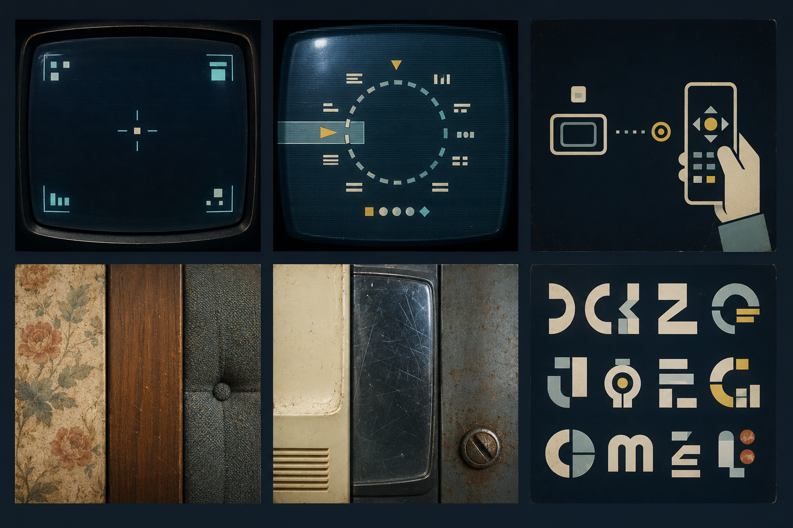
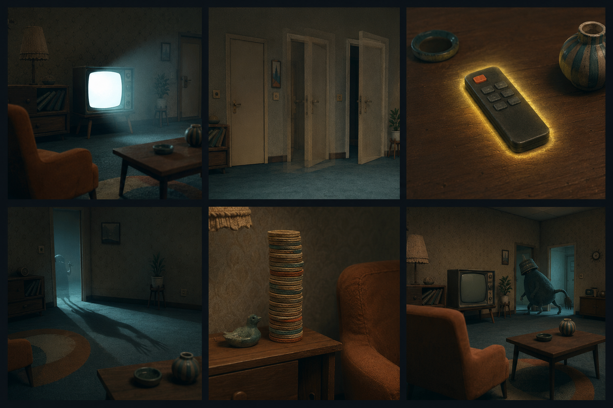

# Direction artistique — salon cathodique

> Version 1 · Jours 8–9  
> Horreur domestique comique, rétro sans nostalgie littérale.

## Intention

Un salon ancien paraît d’abord banal et rassurant. La télévision cathodique,
les lampes et les objets familiers révèlent ensuite une étrangeté lente :
proportions un peu fausses, ombres en retard, monstres gênés par le mobilier et
détails absurdes que l’on remarque une seconde trop tard.

La direction reprend de **YAPYAP** des principes généraux — silhouettes
caricaturales, chaos physique, obscurité colorée, objets manipulables et humour
de groupe — puis les transpose dans un langage domestique original.

| Principe observé | Adaptation pour ce projet |
| --- | --- |
| Silhouettes simples et expressives | Corps mous, asymétriques et maladroits, sans minions ni vêtements de mage |
| Chaos produit par les interactions | Petites réactions en chaîne : lampe coincée, magazines renversés, télécommande perdue |
| Couleurs surnaturelles dans l’obscurité | Ambre domestique contre cyan cathodique, sans reprendre le duo violet/vert du jeu |
| Humour par l’action collective | Humour par le retard, la gêne et la mauvaise lecture de l’espace |
| Interface compacte et immédiatement lisible | OSD de télévision, formes géométriques, scanlines discrètes et focus jaune |

À ne pas reprendre : personnages, architecture de tour, baguettes, noms de
sorts, icônes, costumes, captures d’écran ou composition identifiable de
YAPYAP. La [page Steam de YAPYAP](https://store.steampowered.com/app/3834090/YAPYAP/)
sert uniquement de point de départ analytique.

## Piliers visuels

1. **Familier de travers** — 90 % crédible, 10 % impossible.
2. **Sombre mais lisible** — les formes importantes restent séparées du fond.
3. **Une absurdité à la fois** — un gag fort par cadrage, pas un décor rempli de
   blagues concurrentes.
4. **L’étrange est froid** — le cyan signale une anomalie, jamais le confort.
5. **L’interaction est rare et jaune** — l’accent ne devient pas une décoration.
6. **Le rire arrive après l’inquiétude** — poser, attendre, révéler, laisser
   respirer.

## Moodboard — 24 références originales

Les quatre planches contiennent six images chacune. La numérotation suit
toujours l’ordre de lecture : gauche à droite, rangée du haut puis rangée du bas.
Les 24 images sont originales et ont été produites pour cette direction
artistique ; aucune capture de jeu ni œuvre identifiable n’est incluse.

### Planche A — éclairage, télévision et salon



| Réf. | Annotation | Application |
| --- | --- | --- |
| 01 | Salon lisible par îlots chauds, périphérie bleu-charbon | Conserver trois plans de profondeur même dans la pénombre |
| 02 | Télévision lourde, boutons trop grands, verre bombé | Faire du CRT un personnage architectural, pas un simple écran |
| 03 | Lampe tungstène comme zone de sécurité locale | Réserver l’ambre aux objets encore « normaux » |
| 04 | Couloir cyan plus lumineux que le salon | Annoncer l’étrange hors champ sans recourir au noir |
| 05 | Fauteuil légèrement trop haut, ombre ambiguë | Déformer les objets de 10 à 20 % seulement |
| 06 | Désordre banal avec un niveau de détail absurde | Créer des surfaces propices aux petites réactions physiques |

### Planche B — monstres maladroits et humour visuel



| Réf. | Annotation | Application |
| --- | --- | --- |
| 07 | Créature trop longue utilisant la lampe comme cachette | Le mobilier doit toujours contrarier le monstre |
| 08 | Corps caché, pieds et yeux encore visibles | Faire comprendre le gag par la silhouette avant l’animation |
| 09 | Rideau devenu corps avec une seconde de retard | Transformer un objet ordinaire sans changer sa matière |
| 10 | Aspirateur-créature coincé contre un mur | Préférer l’obstination maladroite à l’agression |
| 11 | Bras excessivement long pour atteindre un minuscule biscuit | Opposer un grand effort à un enjeu dérisoire |
| 12 | Monstre honteux devant les magazines renversés | Terminer l’action par une pose de gêne lisible |

### Planche C — interfaces rétro, textures et typographie



| Réf. | Annotation | Application |
| --- | --- | --- |
| 13 | HUD aux quatre coins, centre presque vide | Laisser l’image respirer et éviter l’interface permanente |
| 14 | Sélecteur radial inspiré d’un bouton de chaîne | Limiter les choix simultanés à 5–7 positions |
| 15 | Télécommande dessinée avec de grandes formes tactiles | Une icône doit rester compréhensible à 24 px |
| 16 | Papier peint, placage bois et tissu râpé | Trois familles tactiles suffisent pour identifier le salon |
| 17 | Plastique crème, verre rayé et métal oxydé | Le vieillissement doit raconter l’usage, pas salir uniformément |
| 18 | Lettres massives construites par blocs et contreformes | Titres expressifs, texte courant neutre et très lisible |

### Planche D — mouvement lent, interaction et mise en scène



| Réf. | Annotation | Application |
| --- | --- | --- |
| 19 | Allumage du CRT révélant progressivement le mobilier | Utiliser la lumière comme transition plutôt qu’un fondu noir |
| 20 | Porte montrée en trois positions fantômes | Mouvement lent, continu, sans accélération agressive |
| 21 | Télécommande entourée d’un halo jaune contenu | Réserver l’accent à une action immédiatement possible |
| 22 | Ombre froide visible avant son propriétaire | Créer l’anticipation avec un décalage de 300 à 500 ms |
| 23 | Tour de dessous de verre inutilement haute | Un détail impossible, traité avec un sérieux absolu |
| 24 | Créature entrant au fond après le point d’attention | Le gag se produit dans le plan secondaire, un temps trop tard |

Les fichiers individuels sont disponibles dans
`assets/moodboard/refs/ref-01.png` à `ref-24.png`.

## Langage de forme

- Volumes principaux arrondis, épais et légèrement asymétriques.
- Meubles exagérés sur un seul axe : dossier trop haut, bouton trop large ou
  pied trop court.
- Créatures composées de deux à quatre masses lisibles, avec peu de détails.
- Yeux petits par rapport au corps ; expression surtout portée par la pose.
- Angles adoucis sur les objets manipulables, angles plus secs dans
  l’architecture.
- Silhouette reconnaissable en aplat à 128 px.

### Test de cohérence

Pour chaque nouvel élément, répondre oui à au moins trois questions :

- Semble-t-il venir de ce salon ?
- Une proportion est-elle subtilement fausse ?
- Peut-il produire un gag physique ?
- Sa fonction reste-t-elle compréhensible sans texte ?
- Est-il lisible dans une vignette sombre ?

## Éclairage

La scène repose sur trois couches, jamais sur une seule lumière générale.

| Couche | Rôle | Valeur cible |
| --- | --- | --- |
| Base bleu-charbon | Maintenir les volumes et éviter les noirs bouchés | 55–65 % de l’image |
| Ambre domestique | Créer les zones sûres et les points de repos | 20–30 % |
| Cyan étrange | Signaler télévision, couloir, ombre ou présence | 10–15 % |
| Jaune d’interaction | Montrer une action possible | 5 % maximum |

Règles :

- Ne jamais utiliser `#000000` comme couleur de scène.
- Bloquer les ombres vers `#0F171D` plutôt que vers le noir absolu.
- Maintenir un liseré de valeur ou de température autour des silhouettes
  importantes.
- Éviter plus de 15 % de l’écran sous la valeur `#101820`.
- Garder une zone de repos sans bruit, scanlines ni particules.
- Tester chaque écran à 40 % de luminosité et en niveaux de gris.

## Palette

### Couleurs de scène

| Rôle | Nom | Hex | Usage |
| --- | --- | --- | --- |
| Dominante sombre | Bleu-charbon | `#182129` | Murs, pénombre, fond général |
| Chaleur du salon | Ambre brûlé | `#C47A4F` | Lampes, bois éclairé, tissus chauds |
| Étrange froid | Cyan cathodique | `#69AFC2` | CRT, couloir, ombres anormales |
| Interaction | Jaune soufre | `#EAD15F` | Focus, objet actif, validation |
| Clair organique | Ivoire os | `#F1E9D8` | Étiquettes, reflets et détails |

Répartition recommandée : **55 / 25 / 15 / 5** pour sombre, chaud, froid et
accent. L’ivoire appartient surtout à l’interface et aux petits reflets.

### Couleurs HTML

```css
:root {
  color-scheme: dark;

  --bg: #141c24;
  --scene-dark: #182129;
  --surface: #202b34;
  --surface-raised: #2b3842;
  --border: #52616b;

  --text: #f1e9d8;
  --text-muted: #b8c1be;

  --warm: #c47a4f;
  --cold: #69afc2;
  --accent: #ead15f;
  --accent-ink: #172026;
}

::selection {
  color: var(--accent-ink);
  background: var(--accent);
}

:focus-visible {
  outline: 3px solid var(--accent);
  outline-offset: 3px;
}
```

### Contrastes WCAG

Ratios calculés pour du texte normal selon WCAG 2.x.

| Premier plan | Fond | Ratio | Résultat |
| --- | --- | ---: | --- |
| `#F1E9D8` texte principal | `#141C24` fond | 14,24:1 | AAA |
| `#B8C1BE` texte secondaire | `#141C24` fond | 9,34:1 | AAA |
| `#F1E9D8` texte principal | `#202B34` surface | 11,94:1 | AAA |
| `#B8C1BE` texte secondaire | `#202B34` surface | 7,83:1 | AAA |
| `#C47A4F` chaud | `#141C24` fond | 5,11:1 | AA |
| `#69AFC2` froid | `#141C24` fond | 6,97:1 | AA |
| `#EAD15F` accent | `#141C24` fond | 11,29:1 | AAA |
| `#172026` encre | `#EAD15F` accent | 10,84:1 | AAA |
| `#172026` encre | `#C47A4F` chaud | 4,91:1 | AA |
| `#172026` encre | `#69AFC2` froid | 6,70:1 | AA |

Combinaisons interdites pour le texte normal :

- Ivoire `#F1E9D8` sur ambre `#C47A4F` : **2,78:1**.
- Ivoire `#F1E9D8` sur cyan `#69AFC2` : **2,04:1**.

Sur les boutons chauds, froids ou jaunes, employer l’encre sombre
`#172026`. Ne jamais transmettre un état uniquement par la couleur : associer
forme, icône, libellé ou mouvement.

## Typographie

La typographie doit évoquer une diffusion analogique, pas imiter une marque de
télévision existante.

| Niveau | Direction | Usage |
| --- | --- | --- |
| Titres | Sans condensée, massive, angles légèrement arrondis | Titres de section, chiffres, écran d’accueil |
| Interface | Sans humaniste ouverte, hauteur d’x généreuse | Navigation, boutons, descriptions |
| CRT | Monospace sobre avec zéro distinct | Chaînes, compteurs, petits états |

Contraintes :

- Corps minimal : 16 px pour le texte, 14 px seulement pour une information
  secondaire non essentielle.
- Longueur de ligne : 45 à 75 caractères.
- Titres en capitales limités à quatre mots.
- Approche légèrement large sur les petits libellés CRT.
- Scanlines et aberration chromatique appliquées au support, jamais directement
  au glyphe principal.
- Une seule famille expressive ; les autres restent fonctionnelles.

Pile de départ :

```css
--font-display: "Arial Narrow", "Roboto Condensed", system-ui, sans-serif;
--font-ui: system-ui, -apple-system, "Segoe UI", sans-serif;
--font-crt: ui-monospace, "SFMono-Regular", Consolas, monospace;
```

## Textures et matière

- Papier peint floral délavé : motif large, contraste faible.
- Bois verni : grain lisible seulement dans les zones chaudes.
- Tissu : fibres épaisses et usure localisée sur les accoudoirs.
- Plastique crème : jaunissement irrégulier autour des boutons.
- Verre CRT : poussière périphérique, rayures rares, reflet légèrement courbe.
- Métal : oxydation sur les vis et les arêtes, pas de salissure uniforme.

Limiter chaque objet à une matière principale et une matière secondaire. Les
microdétails disparaissent au-delà de deux mètres caméra.

## Interface rétro

- L’interface apparaît comme un **OSD temporaire**, pas comme un cadre permanent.
- Entrée en 120–180 ms, maintien selon l’action, disparition en 250–350 ms.
- Quatre coins réservés aux informations persistantes ; centre réservé à la
  visée ou à une décision ponctuelle.
- Épaisseur de trait minimale : 2 px à 1080p.
- Coins arrondis modérément ; aucun panneau en verre futuriste.
- Scanlines à 4–8 % d’opacité, désactivables avec la réduction de mouvement ou
  un mode de lisibilité.
- Le focus jaune doit rester stable : pas de pulsation continue.

## Animation et humour par le timing

| Beat | Durée indicative | Intention |
| --- | ---: | --- |
| Anticipation | 350–600 ms | Laisser croire à une menace |
| Action | 500–900 ms | Mouvement lent, masse perceptible |
| Retard comique | 250–450 ms | Silence entre cause et conséquence |
| Réaction | 450–800 ms | Regard, recul ou pose de gêne |
| Retour au calme | 900–1 400 ms | Ne pas couper le gag trop vite |

Principes :

- Une créature regarde d’abord l’obstacle, puis le percute.
- L’objet tombe après une courte immobilité impossible.
- Le monstre se fige quand le joueur le surprend, sans rugissement automatique.
- La caméra reste sobre ; le gag vient du cadre, pas d’un zoom comique.
- Les boucles d’attente durent 3 à 6 secondes avec de petites irrégularités.
- Respecter `prefers-reduced-motion` pour l’interface et proposer une variante
  sans tremblement ni scintillement.

## Checklist de validation

- [ ] 24 références présentes et annotées.
- [ ] Aucun élément identifiable de YAPYAP reproduit.
- [ ] Aucun noir absolu dans le rendu de scène.
- [ ] Silhouettes lisibles à 128 px et en niveaux de gris.
- [ ] Une seule absurdité dominante par cadrage.
- [ ] Accent jaune limité aux éléments réellement interactifs.
- [ ] Texte courant conforme au contraste AA, idéalement AAA.
- [ ] Texte sombre utilisé sur les fonds chaud, froid et jaune.
- [ ] Interface compréhensible sans effet CRT.
- [ ] Animation testée avec réduction de mouvement.

